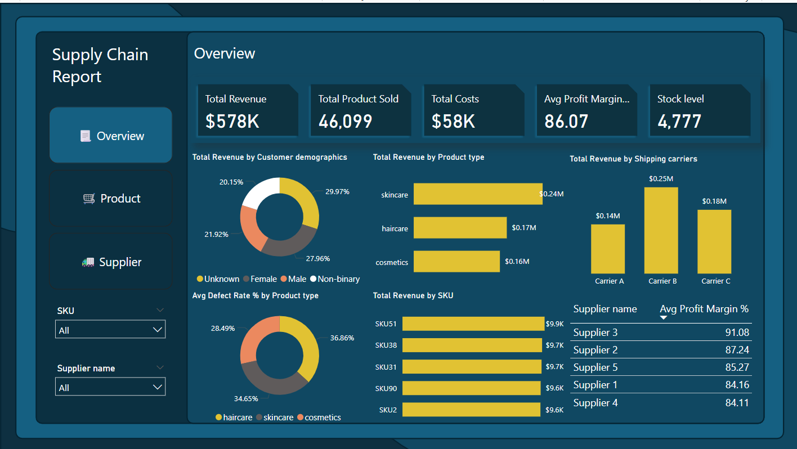
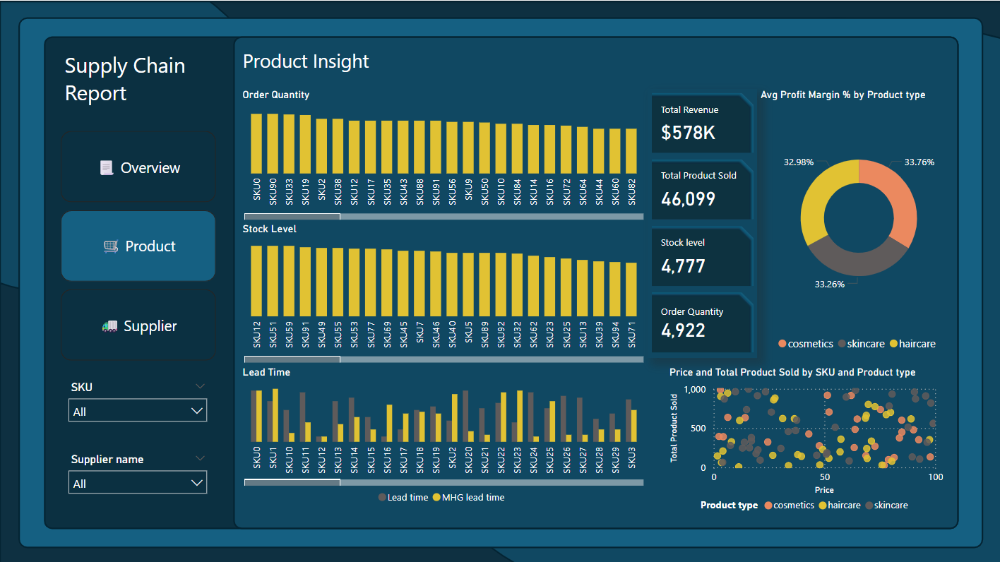
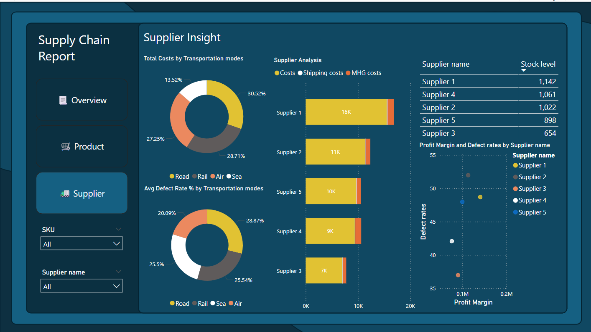

# 📦 Supply Chain Management Dashboard (Power BI)

This project presents an interactive **Supply Chain Dashboard** built using **Power BI**, designed to monitor and analyze the performance of products, suppliers, transportation, and logistics. The dashboard provides actionable insights through key metrics such as revenue, stock levels, lead times, and defect rates to support data-driven supply chain decisions.

---

## 🧩 Problem Statement

Supply chain teams often operate with fragmented data across suppliers, logistics, and inventory systems, leading to inefficient tracking of key performance indicators. The absence of centralized, real-time analytics creates bottlenecks in inventory control, cost optimization, and vendor performance management.

---

## ✅ Solution

This Power BI dashboard integrates and visualizes data from multiple supply chain dimensions (products, suppliers, SKUs, costs, and shipping modes). It enables users to filter and drill down into performance insights, helping businesses optimize procurement strategies, manage risk, and enhance operational efficiency.

---

## 🛠️ Tools & Technologies Used

- **Power BI** – Interactive data visualizations
- **Excel / CSV** – Data source files
- **DAX / Power Query** – Data transformation and modeling
- **Python (Optional)** – For advanced data preprocessing

---

---

## 📊 Dashboard Overview

### 1. **Overview Tab**
- Total Revenue, Total Product Sold, Total Costs
- Revenue by Product Type and Customer Demographics
- Defect Rate % by Product Type
- Revenue by Shipping Carriers
- Supplier Profitability Rankings

### 2. **Product Insight Tab**
- Stock Level, Order Quantity by SKU
- Lead Time vs MHG Lead Time
- Avg Profit Margin by Product Type
- Product Pricing vs Sales Distribution

### 3. **Supplier Insight Tab**
- Cost Breakdown by Transportation Mode
- Avg Defect Rate % by Mode
- Supplier-wise Costs, Stock Level, Profit Margins
- Profit Margin vs Defect Rate Scatterplot

---

## 🖼️ Dashboard Snapshots

Overview 
 

Product
 

Supplier

---

## 📌 Key Metrics Tracked

- 💰 **Revenue & Profit Margin**
- 📦 **Stock Levels & Inventory Turnover**
- ⏱️ **Lead Time & MHG Benchmark**
- 🚚 **Transportation Cost Breakdown**
- ⚠️ **Defect Rates by Product and Supplier**

---

## 🚀 How to Use

1. Open `Supply_Chain_Report.pbix` using Power BI Desktop.
2. Use filters (SKU, Supplier Name) to slice data by product or supplier.
3. Navigate between Overview, Product, and Supplier tabs.
4. Analyze trends and make data-informed supply chain decisions.

---

