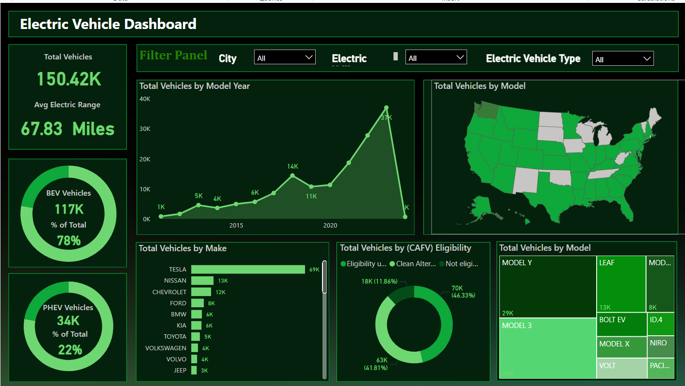

# 🚗 Electric Vehicle Insights Dashboard

## 📌 Project Title
**Electric Vehicle Dashboard – Adoption, Trends & Eligibility Analysis**

## 🎯 Purpose
This project delivers an interactive dashboard to help analyze electric vehicle (EV) adoption trends, regional distribution, consumer preferences, and the impact of CAFV (Clean Alternative Fuel Vehicle) eligibility on the market. It offers a comprehensive overview for stakeholders aiming to understand and make decisions in the growing EV industry.

---

## 🧩 Business Problem Statement
As electric vehicles become increasingly popular, decision-makers in policy, automotive, and sustainability sectors need actionable insights to:
- Track EV growth year over year
- Identify top-performing manufacturers and models
- Evaluate effectiveness of EV-related incentives
- Understand regional trends for infrastructure planning

This dashboard solves these problems by visualizing EV-related metrics across time, geography, brand, and eligibility status.

---
## 📸 Dashboard Preview

---
## 🌀 Process Overview

1. **Data Collection**  
   Source data includes fields like model year, make, model, vehicle type, state, and CAFV eligibility.

2. **Data Cleaning & Transformation**  
   - Removed nulls and duplicates  
   - Standardized categorical data  
   - Created aggregated and derived fields  
   - Grouped data by relevant dimensions (make, model, state, year)

3. **Visualization & Dashboard Design**  
   Used **Power BI** to create responsive charts with filter interactivity, geographical mapping, and drill-down capabilities.

---

## 📊 Charts & Insights

| Chart Title | Visualization Type | Business Insight |
|-------------|--------------------|------------------|
| **Total Vehicles by Model Year (2010 onwards)** | Line / Area Chart | Tracks yearly growth in EV adoption |
| **Total Vehicles by State** | Map Chart | Identifies regional adoption trends |
| **Top 10 Vehicles by Make** | Bar Chart | Shows dominant EV manufacturers |
| **Vehicles by CAFV Eligibility** | Donut Chart | Evaluates impact of government incentives |
| **Top 10 Vehicles by Model** | Tree Map | Highlights consumer-preferred EV models |

---

## 🛠️ Tools & Technologies Used

- **Power BI** – Dashboard development and data visualization
- **Power Query** – Data cleaning and shaping
- **DAX** – Calculated measures and KPIs
- **Excel** – Initial data analysis and validation
- **Map Visuals (Bing)** – For state-wise distribution of EVs

---

## 🔍 Key Insights

- Tesla leads the market with over **69K** vehicles.
- **Model Y** and **Model 3** are top-performing EVs.
- Approximately **46%** of vehicles are CAFV-eligible, showing incentive effectiveness.
- EV adoption peaked around **2022**, with rapid growth post-2017.
- Specific states/regions show significantly higher EV concentrations.

---

## 👥 Stakeholders & Use Cases

- **Policymakers**: Evaluate adoption and incentive impact
- **EV Manufacturers**: Understand brand positioning
- **Urban Planners**: Plan EV charging infrastructure
- **Investors**: Forecast growth in clean mobility

---

---

## 🚀 Future Enhancements

- Add trend filtering by state/city
- Integrate emissions and fuel savings metrics
- Enable drill-down for model performance by region
- Add real-time vehicle registration APIs

---

## 🧠 Learnings

- Built a business-ready dashboard using Power BI
- Applied geographic and categorical data visualization
- Gained experience in transforming raw data into insights
- Improved stakeholder communication through visual storytelling

---

